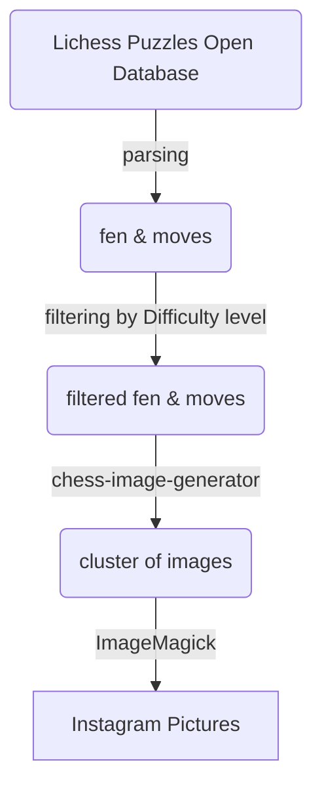
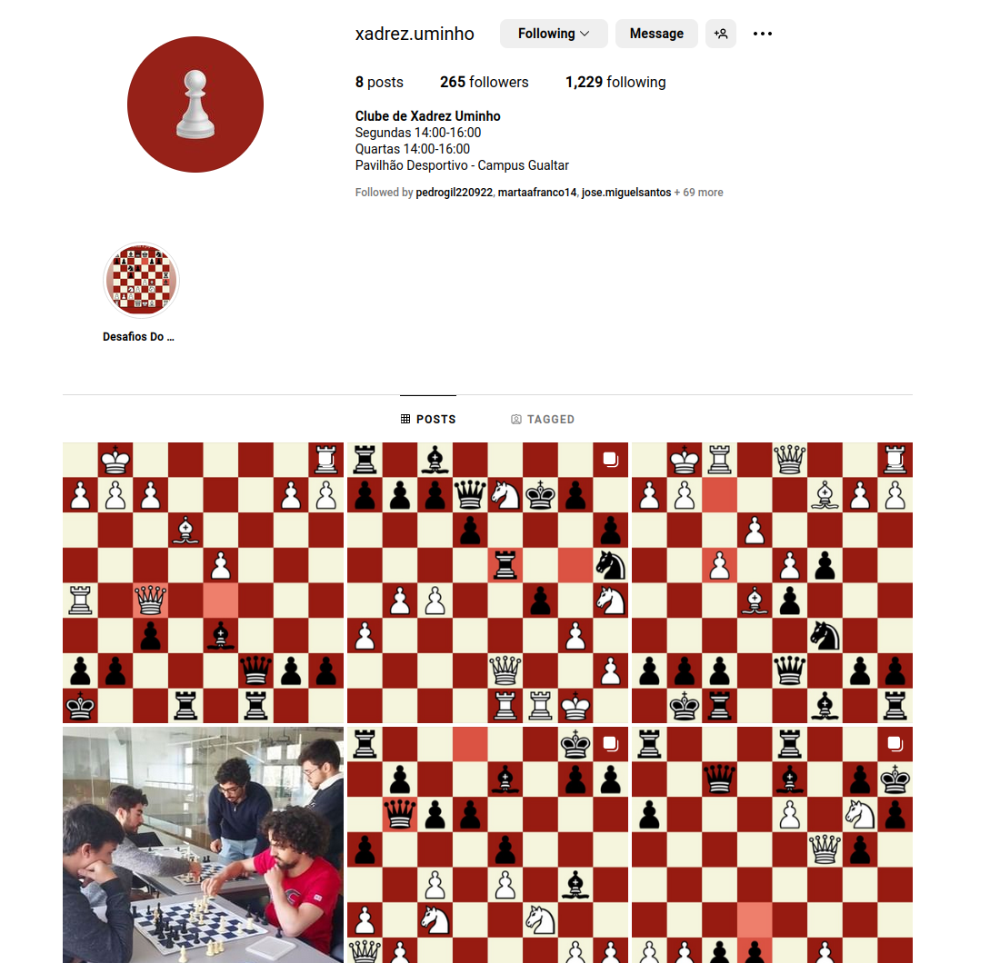
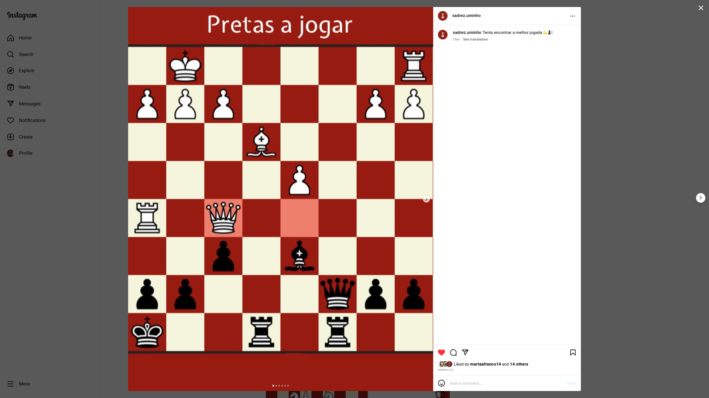

# instagram-puzzles-generator
I made this project in order to automate a puzzle collection to publish and advertise chess on my University chess club's Instagram.am.

Project flow

Generated content:

## Dependecies
* jjcli
* chess 
* https://github.com/andyruwruw/chess-image-generator
* ImageMagick
