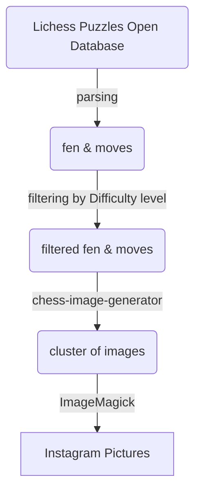

# instagram-puzzles-generator
I made this project in order to automate a puzzles collection to publish and advertisement chess
in my Universities chess club instagram.

Project flow

Generated content:

## Dependecies
* jjcli
* chess 
* https://github.com/andyruwruw/chess-image-generator
* ImageMagick
